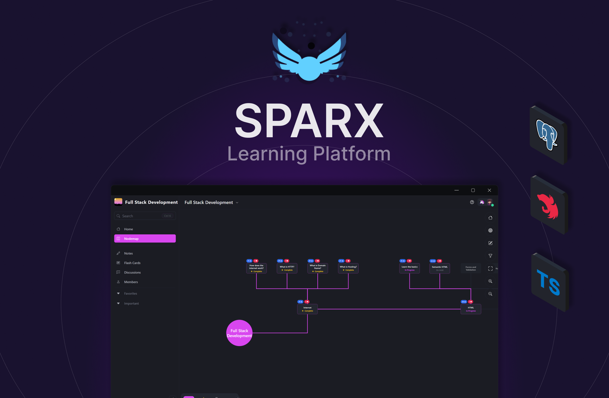

<p align="center">
  <a href="http://spa-rx.ca" target="blank"></a>
</p>

[circleci-image]: https://img.shields.io/circleci/build/github/nestjs/nest/master?token=abc123def456
[circleci-url]: https://circleci.com/gh/nestjs/nest

<h3>Introduction</h3>
<p>Navinotes is a learning platform where users create personalized roadmaps, share educational content, and track progress in a collaborative community, simplifying and enriching the learning experience.
</p>

<h3>Features</h3>
<p>Navinotes is a learning platform where users create personalized roadmaps, share educational content, and track progress in a collaborative community, simplifying and enriching the learning experience.
</p>

<h3>Usage</h3>
<p>Navinotes is a learning platform where users create personalized roadmaps, share educational content, and track progress in a collaborative community, simplifying and enriching the learning experience.
</p>

<h3>Development</h3>
<p>Navinotes is a learning platform where users create personalized roadmaps, share educational content, and track progress in a collaborative community, simplifying and enriching the learning experience.
</p>

```bash
# development
$ npm run start

# watch mode
$ npm run start:dev

# production mode
$ npm run start:prod
```
