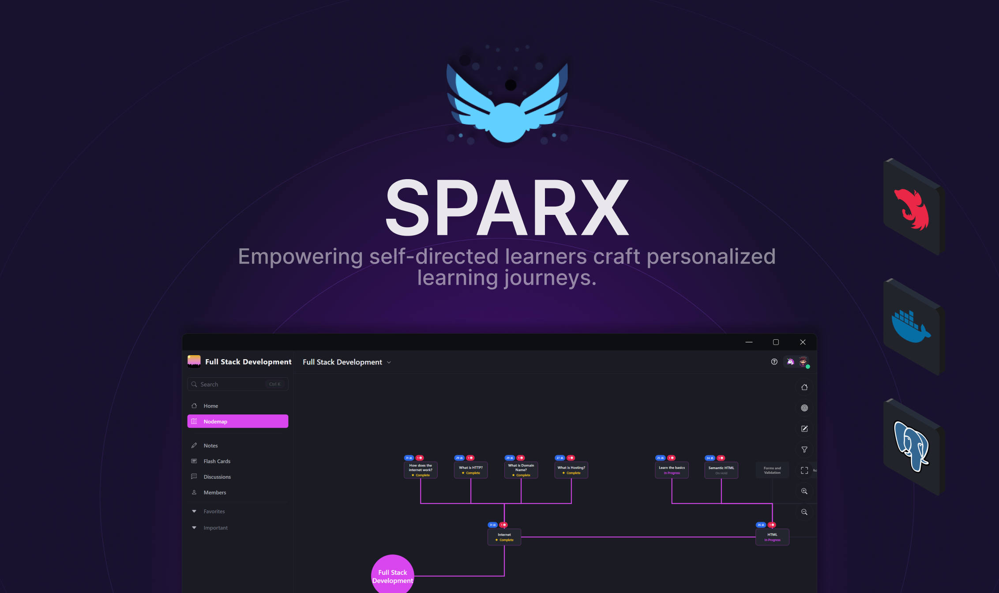
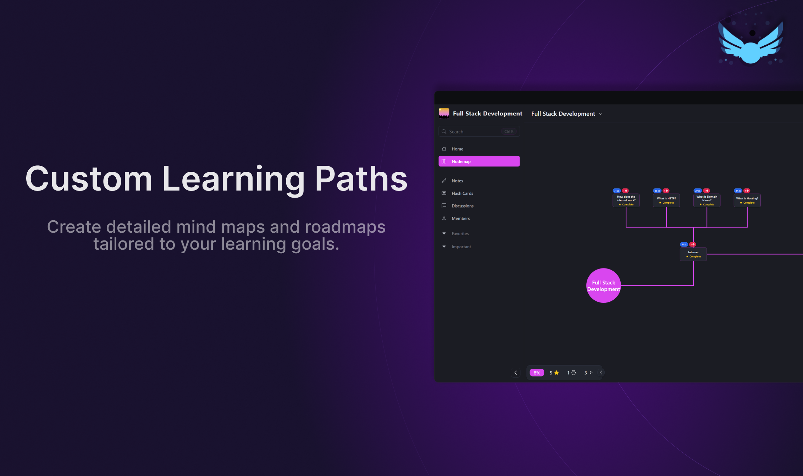
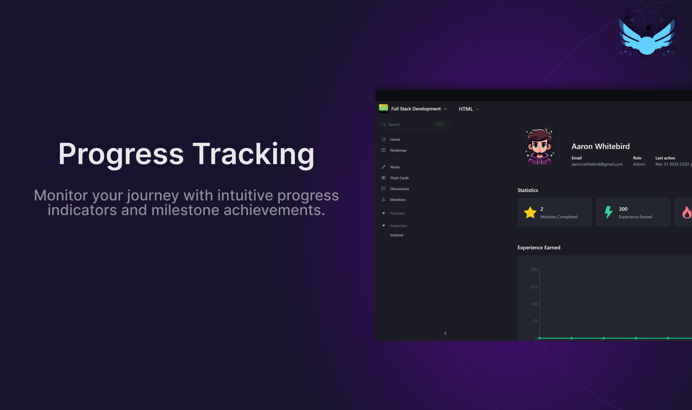

  

Transforming solo and collaborative learning with customizable roadmaps, interactive resources, and community-driven knowledge sharing.

<h3>Introduction</h3>

Welcome to Sparx – a unique platform designed to revolutionize the way individuals and groups engage with self-directed learning. At the heart of the mission is the belief that learning should be personalized, collaborative, and simple to engage with. Whether you're diving into a new topic, mastering a skill, or building a comprehensive study plan, Sparx offers the tools and community support to make your learning journey as effective and enjoyable as possible.

<h3>Features</h3>

    
&nbsp;
     

    
&nbsp;
     

<h3>Usage</h3>

To get started with Sparx, the hosted version of the product can be used. You can get started immediately at spa-rx.ca. To demo the application, click the "Sign in Anonymously" button. The website provides an overview of the application and a guided tour.

